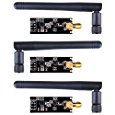
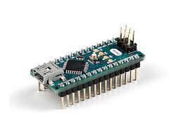
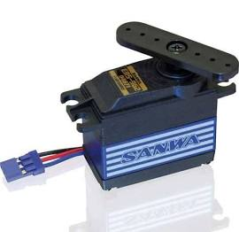
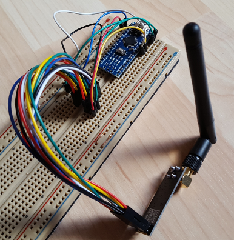
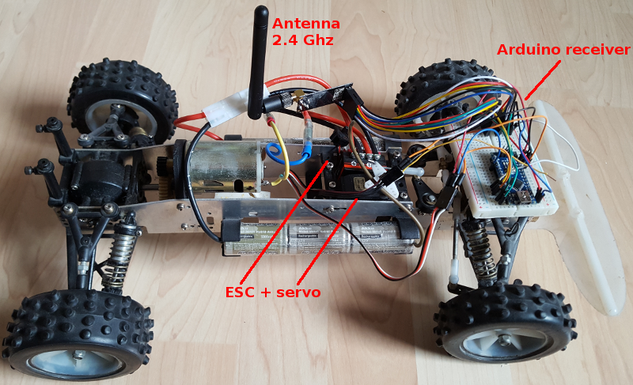

# drone-car

Drone Car controlled by WiFi

Purpose is to leverage IoT spare to pilot an old car model 1/10th.

(this repo serves more as notes than tutorial or full project description)

## BOM

* Some RC car where radio will be deprecated by custom receiver :-)

* [nRF24L01 x2](https://www.amazon.fr/dp/B06WD17WLS/ref=pe_386181_51767671_TE_dp_1)

* [Arduino Nano x2](http://www.ebay.fr/sch/i.html?_from=R40&_trksid=p2047675.m570.l1313.TR6.TRC1.A0.H0.Xarduino+nano.TRS0&_nkw=arduino+nano&_sacat=0)

## Story

### Discover nrf24l01 - example tx/rx

If you need full understanding of what is nRF24L01, follow guides in [References](#references) for simple sketches.

These are copied under [nRF24L01 basic examples](references/01-discover-rf24)

### Discover servos - example move servos

My Sanwa servos seems very old, not same pinout that others!

Anyway, keep in mind the discrepency!

The pin layout was as follows:
* Pin1 = Signal
* Pin2 = Neg -
* Pin3 = Pos +

Most pin layout is now:
* Pin1 = Signal
* Pin2 = Pos +
* Pin3 Neg -

Just *hook each PWM signal to digital pin of arduino nano* and use sketch such as default arduino [servo sketch](references/02-discover-servos)

### Remote controlling

Creating rx/tx sketches together with the 2 arduino nano with radio.

Below is my 25 year old RC car upgraded prototype:

Once plugged, you can use arduino IDE to send value(s) for each PWM to the receiver which will apply.

[Test sketches](src/00-rc-nrf24)

I used only 1 PWM to calibrate and result of *Calibration* shows below integers:
* *direction* = 60 to 120 with straight ~90 
* *speed* = 30 to 160 with stop ~95
  95 to 160 : backward faster and faster
  95 to 30  : forward faster and faster

## References

Googling nRF24L01:

* [Nrf24L01 How-To](https://arduino-info.wikispaces.com/Nrf24L01-2.4GHz-HowTo#lib)

* [Bare Minimum example](https://arduino-info.wikispaces.com/Nrf24L01-2.4GHz-ExampleSketches#bm1)

* [nRF24L01 simple scketch](http://www.elec-cafe.com/multiple-nodes-nrf24l01-wireless-temperature-ds18b20-with-arduino-uno-2-transmitter-1-receiver/)

Googling servos:

* [Sanwa SM-635 pins](http://www.rcmf.co.uk/4um/rc-radio-gear/sanwa-servo-wiring/)

